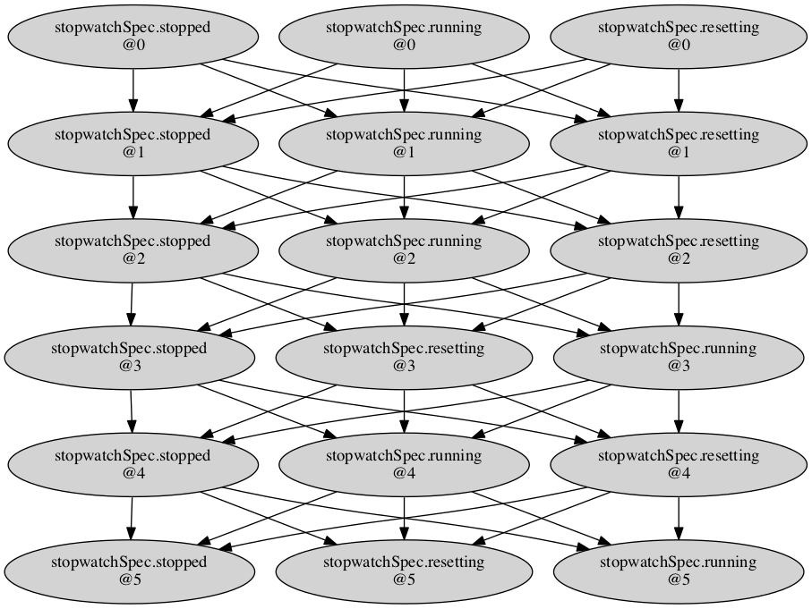
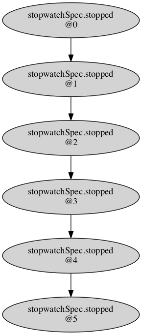

.. _9_other/3_test_generation:

Test Generation
===============

Most test generation techniques analyze the syntax of the model they run on to
generate test cases satisfying some coverage criteria. Kind 2 does not follow
this approach but instead generates tests based on the specification, more
precisely the *modes* of the specification.

Kind 2's test generation was developed in a context where the actual
implementation of the components is **outsourced**. That is, a *model* of the
system is written in-house based on some specification. The model is then
verified correct with respect to its specification, using Kind 2 of course,
before the specification is given to external sub-contractors that will
eventually produce some binaries but will **not** give access to their source
code. At this point, there is a need to test these binaries in-house.

In this context, syntactic test generation is arguably not appropriate as it
would be based on the syntax of the *model*\ , not that of the actual source code
of the binaries. There is no reason to believe any connection between the two.
Now, the only thing we know of the binaries is that they are supposed to
verify the specification. For this reason, Kind 2's test generation ignores
the syntax of the input model and instead builds on contracts 
(see :ref:`9_other/2_contract_semantics`), and more precisely on the
notion on *mode*.

Combinations of modes as abstractions
-------------------------------------

Modes specify behaviors specific to a situation in a contract, and can be seen
as abstractions of the states allowed by the assumptions of the contract. Note
that because of the *mode exhaustiveness check*\ , there is always at least one
mode active in any reachable state.

One can explore, starting from the initial states, the mode that can be
activated up to some depth. For example, consider the following ``stopwatch``
system:

.. code-block:: none

   contract stopwatchSpec ( tgl, rst : bool ) returns ( c : int ) ;
   let
     var on: bool = tgl -> (pre on and not tgl) or (not pre on and tgl) ;
     assume not (rst and tgl) ;
     guarantee c >= 0 ;
     mode resetting ( require rst ; ensure c = 0 ; ) ;
     mode running (
       require not rst ; require on ; ensure c = (1 -> pre c + 1) ;
     ) ;
     mode stopped (
       require not rst ; require not on ; ensure c = (0 -> pre c) ;
     ) ;
   tel

   node previous ( x : int ) returns ( y : int ) ;
   let
     y = 0 -> pre x ;
   tel

   node stopwatch ( toggle, reset : bool ) returns ( count : int ) ;
   con
     import stopwatchSpec ( toggle, reset ) returns ( count ) ;
   noc
   var running : bool ;
   let
     running = (false -> pre running) <> toggle ;
     count = if reset then 0 else
       if running then previous(count) + 1 else previous(count) ;
   tel

It seems that any of the three modes from the contract can be active at any
point, since their activation only depends on the values of the inputs. We can
ask Kind 2 to generate the graph of mode paths up to some depth (5 here):

.. code-block:: none

   kind2 --testgen true --testgen_len 5 stopwatch.lus

This will generate the following graph (and a lot of other files we will
discuss below but omit for now):

   
   Stopwatch DAG

The graph confirms our understanding of the specification, each mode can be
activated at any time. Say now we made a mistake on the assumption:

.. code-block:: none

     assume not (rst or tgl) ;

It is now illegal to reset or start the stopwatch. The graph is generated very
quickly as with this assumption the system cannot do anything:

   Stopwatch mistake DAG

**N.B.** In this simple system, only one mode could be active at a time. This
is not the case in general. See for example the mode graphs for the `mode logic <https://github.com/kind2-mc/cocospec_tcm_experiments/blob/master/graphs/MODE_LOGIC/dot.pdf>`_
or the `full model <https://github.com/kind2-mc/cocospec_tcm_experiments/blob/master/graphs/Mode_plus_Longitudinal/dot.pdf>`_
of the Transport Class Model (TCM) case study.

Generating test cases
---------------------

Since Kind 2 can explore the traces of combinations of modes that can be
activated from the initial states, generating test cases is simple. Each test
case is simply a trace of inputs, or *witness*\ , triggering a different path of
mode combinations in the DAG discussed above.

Each witness is logged in JSON file. It is in the same format as the interpreter 
input format. (See the :ref:`Interpreter <9_other/8_interpreter>`)

A glue XML file lists all the test cases
and provides additional information such as the trace of mode combinations they
triggered in the model.

..

   But aren't the witnesses still based on how the model is written?

Yes they are. There is no way to completely abstract the model/prototype away,
nor is it desirable. Generating test cases solely on the specification is not
realistic unless the specification is extremely strong and precise, which it
very rarely is. (Also, if it was, it would arguably be easier to produce
the object code as a refinement of the specification using the B-method for
instance.)

Analyzing the executable
------------------------

The purpose of generating these test cases is to eventually run them on an
executable version of the model to check whether it crashes and whether it
respects the specification.

For convenience, Kind 2 offers a feature, 
a :ref:`contract monitor <contract-monitor>`, which checks whether the output
produced by the executable for a given test case respects the contract.

The contract monitor reads the input values of the test case that are fed
to the System Under Test (SUT), along with the output values returned by the
SUT, and reports the truth values of the guarantees and modes of the original
contract. The input format for the contract monitor is the same as the
:ref:`interpreter <9_other/8_interpreter>` input format, except that 
the input includes not only the values of the input variables but also 
the values of the output variables.
