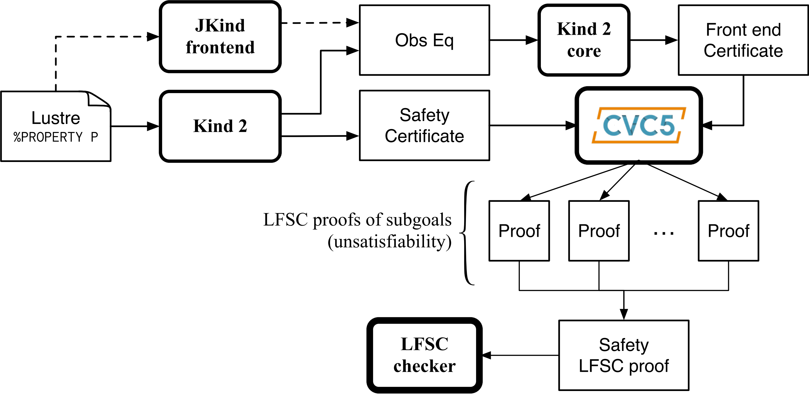
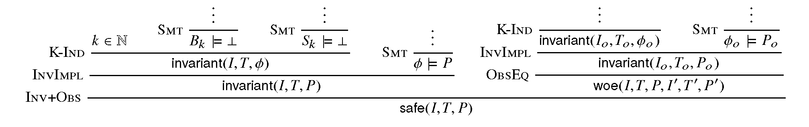

.. _9_other/5_proofs:

Proof Certificates
==================

One clear strength of model checkers, as opposed to proof assistants, say, is
their ability to return precise *error traces* witnessing the violation of a
given safety property. Such traces not only are invaluable for designers to
correct bugs, they also constitute a checkable certificate. For instance Kind 2
display a counter-example trace that shows the evolution of values of all
variables in the system up to a violation of the property. In most cases, it is
possible to use a counter-example for a safety property to direct the execution
of the system under analysis to a state that falsifies that property.  In
contrast, most model checkers are currently unable to return any form of
corroborating evidence when they declare a safety property to be satisfied by
the system. This is unsatisfactory in general since these are complex tools
based on a variety of sophisticated algorithms and search heuristics, and so
are not immune to errors.

To mitigate this problem, Kind 2 accompanies its safety claims with a
*certificate*\ , an artifact embodying a proof of the claim. The certificate can
then be validated by a trusted *certificate/proof checker*\ , in our case the
`LFSC checker <https://github.com/cvc5/LFSC>`_.

Certification chain
-------------------

The certification process for Kind 2 is depicted in the graph below. Kind 2
generates two sorts of safety certificates, in the form of SMT-LIB 2 scripts:
one certifying the faithfulness of the translation from the Lustre input model
to the internal encoding, and another one certifying the invariance of the
input properties for the internal encoding of the input system. These
certificates are checked by cvc5, then turned into LFSC proof objects by
collecting cvc5's own proofs and assembling them to form an overall proof that
can be efficiently verified by the LFSC proof checker.

   Certification process

Trust is claimed at a higher level when both proof certificates are present. In
practice, this means that Kind 2 didn't make any mistake in its model checking
phase, and that the translation of the Lustre model to the internal
representation is faithful.

Producing certificates and proofs with Kind 2
---------------------------------------------

To illustrate this process, we rely on the toy model below (\ ``add_two.lus``\ ).
The model encodes in Lustre a synchronous reactive component, ``add_two``\ , that
at each execution step other than the first, outputs the maximum between the
previous value of its output variable ``c`` and the sum of the current values of
input variables ``a`` and ``b``.  The value of ``c`` is initially ``1.0``.  The model
is annotated with an invariance property stating that, at each step, the output
``c`` is positive whenever both inputs are.

.. code-block:: none

   node add_two (a, b : real) returns (c : real) ;
     var v : real;
         P : bool;
   let
     v = a + b ; 
     c = 1.0 -> if (pre c) > v then (pre c) else v ;
     P = (a > 0.0 and b > 0.0) => c > 0.0 ;
     --%PROPERTY P;
   tel

Kind 2 offers the possibility to generate two types of certificates, SMT-LIB 2
certificates and actual proofs in the format of LFSC. It will do so only for
systems whose properties (or contracts) are all proven valid.

Requirements
^^^^^^^^^^^^

Frontend certificates and proofs production require the user to have JKind
installed on their machine (together with a suitable version of Java).

SMT-LIB 2 certificates do not require anything additional except for an SMT
solver to check the certificates.

LFSC proofs production requires cvc5 (the binary can be specified with
``--cvc5_bin``), its LFSC proof signatures, and the LFSC checker for the final
proof checking phase.

LFSC checker
~~~~~~~~~~~~

A bash script to download and build the LFSC checker is distributed with Kind 2.
The script also generates an easy-to-use bash script to check LFSC proofs
generated by Kind 2:

.. code-block:: none

   lfsc
   |-- get-lfsc-checker.sh
   |-- bin
       |-- lfsc-check.sh
       |-- lfscc
   |   ...
   |-- signatures
       |-- kind.plf
       |-- ...

The checker can be downloaded and compiled using:

.. code-block:: none

   lfsc/get-lfsc-checker.sh

SMT-LIB 2 certificates
^^^^^^^^^^^^^^^^^^^^^^

These certificates are always produced but are only used as an intermediate
step for LFSC proof production. The user still has the possibility to get them
as the final output of Kind 2 in a convenient form. To do so, invoke Kind 2 (on
the previous example ``add_two.lus``) with the following

.. code-block:: none

   kind2 --certif true add_two.lus

For successful runs, the output of Kind 2 will contain:

.. code-block:: none

   Post-analysis: certification

   Certificate checker was written in add_two.lus.out/certif/certificate.smt2
   Generating frontend eq-observer with jKind ...
   Generating frontend certificate
   ...
   Certificate checker was written in add_two.lus.out/certif/FEC.kind2.out/certif/FECC.smt2

The certificates are located in the directory ``add_two.lus.out/certif`` which has the
following structure:

.. code-block:: none

   add_two.lus.out/certif
   |-- certificate_checker
   |-- certificate_prelude.smt2
   |-- certificate.smt2
   |-- FEC.kind2
   |-- FEC.kind2.out/certif
       |-- FECC_checker
       |-- FECC_prelude.smt2
       |-- FECC.smt2
       |-- observer_sys.smt2
   |-- jkind_sys_lfsc_trace.smt2
   |-- jkind_sys.smt2
   |-- kind2_sys.smt2
   |-- observer_lfsc_trace.smt2
   |-- observer.smt2

In particular, it contains two scripts of interest: ``certificate_checker`` and
``FECC_checker``. They are meant to be run with the name of an SMT solver as
argument and should produce each three ``unsat`` results. The first one checks
that the certificate of invariance is valid with the provided SMT solver and
the second script checks that the *frontend certificate is valid*.

.. code-block:: none

   > add_two.lus.out/certif/certificate_checker z3
   Checking base case
   unsat
   Checking 1-inductive case
   unsat
   Checking property subsumption
   unsat

   > add_two.lus.out/certif/FEC.kind2.out/certif/FECC_checker z3
   Checking base case
   unsat
   Checking 1-inductive case
   unsat
   Checking property subsumption
   unsat

LFSC proofs
^^^^^^^^^^^

The other option offered by Kind 2, and the most trustworthy one, is to produce
LFSC proofs. This can be done with the following invocation:

.. code-block:: none

   kind2 --proof true add_two.lus

Successful runs emit outputs that contain lines such as:

.. code-block:: none

   Post-analysis: certification

   Generating frontend eq-observer with jKind ...
   Generating frontend proof
   ...
   Final LFSC proof written to add_two.lus.out/add_two.lus.1.lfsc

The important one is the last message that indicate the file in which the proof
was written. The directory produced by Kind 2 will have the following
structure:

.. code-block:: none

   add_two.lus.out/
   |-- add_two.lus.1.lfsc
   |-- certificates.1
       |-- FEC.kind2
       |-- base.smt2
       |-- frontend_base.smt2
       |-- frontend_implication.smt2
       |-- frontend_induction.smt2
       |-- frontend_proof.lfsc
       |-- implication.smt2
       |-- induction.smt2
       |-- jkind_sys.smt2
       |-- jkind_sys_lfsc_trace.smt2
       |-- kind2_phi.smt2
       |-- kind2_phi_lfsc_trace.smt2
       |-- kind2_sys.smt2
       |-- kind2_sys_lfsc_trace.smt2
       |-- obs_phi.smt2
       |-- obs_phi_lfsc_trace.smt2
       |-- observer.smt2
       |-- observer_lfsc_trace.smt2
       |-- proof.lfsc

It contains as many proofs (at the root) as there are relevant analysis
performed by Kind 2 (for modular and compositional reasoning). To make sure
that the proof is an actual proof, one needs to call the LFSC checker on the
generated output, together with the correct signatures:

.. code-block:: none

   lfscc <cvc5 signatures in order> <kind 2 signature> add_two.lus.out/add_two.lus.1.lfsc

or use the convenient bash script generated by ``lfsc/get-lfsc-checker.sh``

.. code-block:: none

   lfsc-check.sh add_two.lus.out/add_two.lus.1.lfsc

The return code for either command execution is ``0`` when everything was checked
correctly. Three lines will be displayed when both the proof of invariance and
the proof of correct translation by the frontend are valid:

.. code-block:: none

   success
   success
   success

In the case where only the invariance proof was produced and checked, the
return code will still be ``0`` but only a single ``success`` will be in the
output of ``lfsc-checker``.

Proof options
^^^^^^^^^^^^^

Kind 2 supports several options to control the format and granularity of proofs:

* ``--smaller_holes <bool>`` (default ``false``\ ) -- By default, LFSC proofs
  generated by Kind 2 contain holes encoded as ``(trust ..)`` steps. This option
  reduces the size of holes in the generated proofs, and thus, increases trust in
  Kind 2's result. The option is disabled by default as the more granular proofs
  take significantly more time to generate, are orders of magnitude larger, and
  take longer time to verify than proofs with bigger holes. Note: this option
  reduces the size of holes in the proofs and not their number, which is likely to
  increase when it is enabled.

* ``--flatten_proof <bool>`` (default ``false``\ ) -- Break the proof down into
  a sequence of lemmas. The proof for each lemma is verified by the LFSC checker
  and erased immediately. This option helps reduce the memory footprint of the
  LFSC checker and improve its performance. It is recommended to enable this
  option with ``--smaller_holes``. Note: enabling this option will increase the
  number of ``success`` messages displayed by the LFSC checker.

Contents of certificates
------------------------

For a given problem (whose safety property is P), an internal certificate
consists in only a pair :math:`(k, \phi)` where :math:`\phi` is a *k*\ -inductive invariant of the
system which implies the original properties. SMT-LIB 2 certificates are in
fact scripts whose check make sure that :math:`\phi` implies P and is *k*\ -inductive. The
LFSC proof is a formal proof that P is invariant in the system, using
sub-proofs of validity (unsatisfiability) returned by cvc5.

LFSC signature
--------------

A proof system is formally defined in LFSC through *signatures*, which contain
a definition of the system's language together with axioms and proof rules. The
proof system used by cvc5 is defined over a number of signatures, which are
included in its source code distribution. Those relevant to this work include
signatures for propositional logic and resolution (``boolean_rules.plf``);
first-order terms and formulas, with rules for CNF conversion and abstraction to
propositional logic (``cnf_rules.plf``); equality over uninterpreted functions
(``equality_rules.plf``); and real and integer linear arithmetic
(``arith_rules.plf``).

cvc5's proof system is extended with an additional signature (``kind.plf``) for
*k*\ -inductive reasoning, invariance and safety.  This signature also specifies
the encoding for state variables, initial states, transition relations, and
property predicates.  State variables are encoded as functions from natural
numbers to values.  This way, the unrolling of the transition relation does not
need the creation of several copies of the state variable tuple **x**.  For
example, for the state vector **x** = (\ *y* , *z*\ ) with *y* of type real and *z*
of type integer, the LFSC encoding will make *y* and *z* respectively functions
from naturals to reals and integers.  So we will use the tuples (\ *y*\ (0) ,
*z*\ (0)), (\ *y*\ (1) , *z*\ (1)), ... instead of (\ *y0* , *z0*\ ), (\ *y1* , *z1*\ ), ... where
*y0* , *y* 1 , ..., *z0* , *z1*\ , ... are (distinct) variables.  Correspondingly,
our LFSC encoding of a transition relation formula T[\ **x**\ , **x'**\ ] is
parametrized by two natural variables, the index of the pre-state and of the
post-state, instead of two tuples of state variables.  Similarly, I, P and :math:`\phi`
are parametrized by a single natural variable.

The signature defines several derivability judgments,
including one for proofs of invariance, which has the following type:

.. math::

   \begin{split}
   \text{invariant}: \Pi\ \text{I}:&\ \mathbb{N} \to \text{formula}.\\
   \Pi\ \text{T}:&\ \mathbb{N} \to \mathbb{N} \to \text{formula}.\\
   \Pi\ \text{I}:&\ \mathbb{N} \to \text{formula}. \text{Type}
   \end{split}

It also contains various rules to build proofs of invariance by *k*\ -induction.
This signature also specifies how to encapsulate proofs for the front-end
certificates by providing a additional judgment, safe(I,T,P,I',T',P'), which
can be derived only when invariant(I,T,P) is derivable and the observational
equivalence between (I,T,P) and (I',T',P') is provable (judgment woe). Self
contained proofs of safety follow the sketch depicted below, where Smt stands
for an unsatisfiability rule whose proof tree is obtained, with minor changes,
from a proof produced by cvc5.

   Proof sketch

